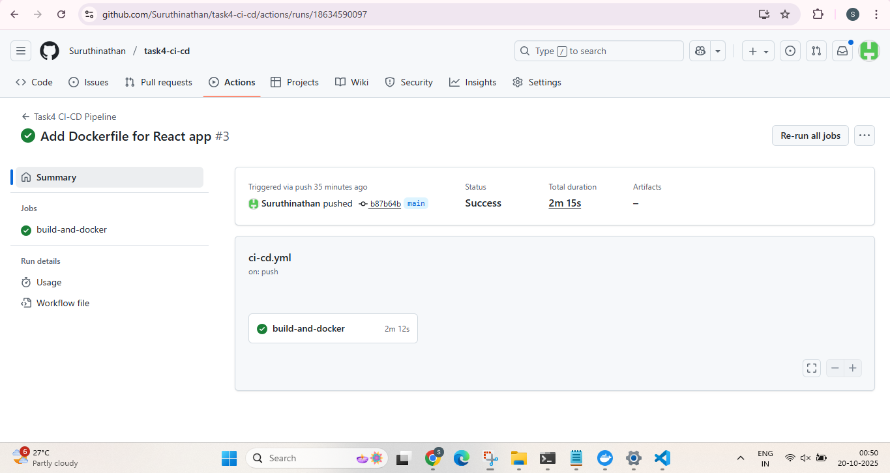
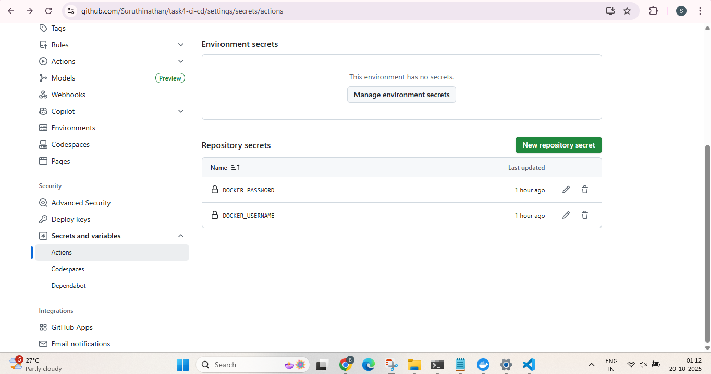
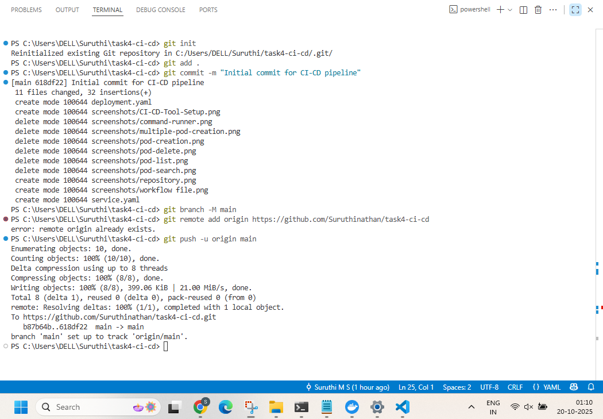
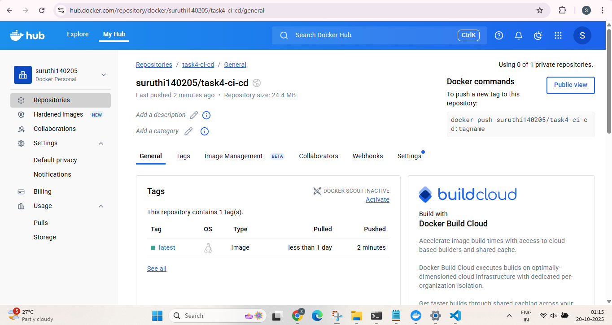
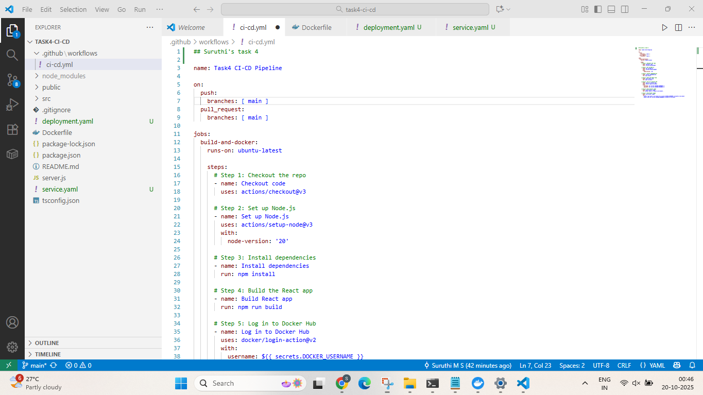
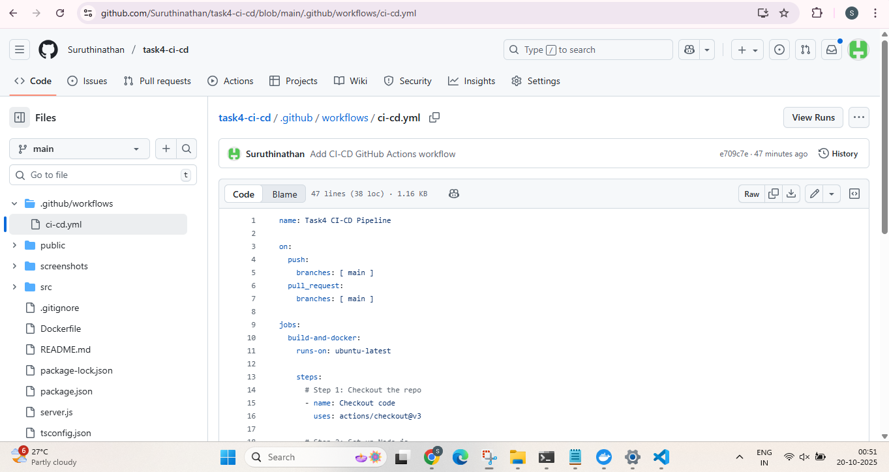

# Task 4 – CI-CD Pipeline

## **Overview**

This repository demonstrates a **CI-CD pipeline** for a sample React application (from Task 3).

The pipeline is implemented using **GitHub Actions** and includes:

1. **Code build** – Installs dependencies and runs a build.
2. **Docker build** – Builds a Docker image of the application.
3. **Docker push** – Pushes the image to **Docker Hub**.


## **Repository Structure**

```
task4-ci-cd/
├── .github/
│   └── workflows/
│       └── ci-cd.yml       # GitHub Actions workflow
├── Dockerfile              # Docker build instructions
├── package.json            # React app metadata
├── src/                    # React app source code
└── public/                 # React app public files
```

---

## **CI-CD Workflow**

The GitHub Actions workflow (`.github/workflows/ci-cd.yml`) performs the following steps:

1. **Checkout code** – Pulls the repository code.
2. **Set up Node.js** – Installs Node.js environment.
3. **Install dependencies** – Runs `npm install`.
4. **Run build** – Runs `npm run build`.
5. **Docker build** – Builds the Docker image:

   ```bash
   docker build -t suruthi140205/task4-ci-cd:latest .
   ```
6. **Docker push** – Pushes the Docker image to Docker Hub.

---

## **Docker Image**

* **Image name:** `suruthi140205/task4-ci-cd:latest`
* **Docker Hub:** [https://hub.docker.com/r/suruthi140205/task4-ci-cd](https://hub.docker.com/r/suruthi140205/task4-ci-cd)

---

## **Screenshots**

Make sure to capture **screenshots for submission**:

| # | Feature / Description         | Screenshot                                                |
| - | ----------------------------- | --------------------------------------------------------- |
| 1 | CI-CD Tool Setup              |      |
| 2 | Docker Hub Secrets Configured |  |
| 3 | Git Push to Repository        |                      |
| 4 | Pipeline Run / Report         |        |
| 5 | GitHub Repository             |                  |
| 6 | GitHub Actions Workflow File  |            |  


## **Usage**

1. Clone the repository:

```bash
git clone https://github.com/Suruthinathan/task4-ci-cd.git
cd task4-ci-cd
```

2. Build and run Docker locally (optional):

```bash
docker build -t suruthi140205/task4-ci-cd:latest .
docker run -p 8080:80 suruthi140205/task4-ci-cd:latest
```

3. Access the app in your browser (optional):

```
http://localhost:8080
```

---
