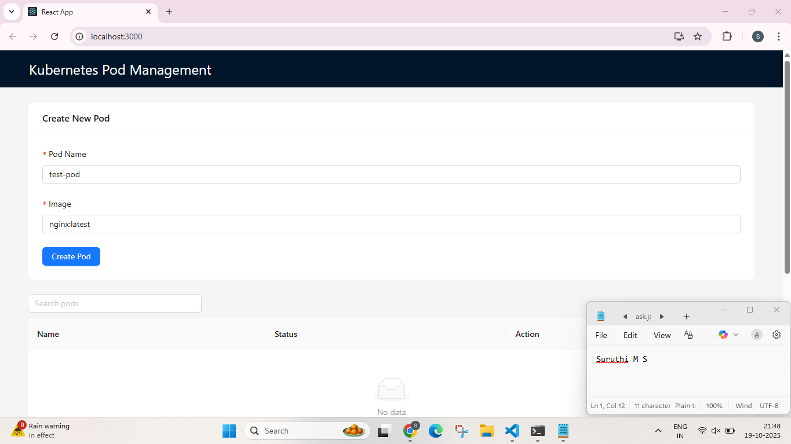
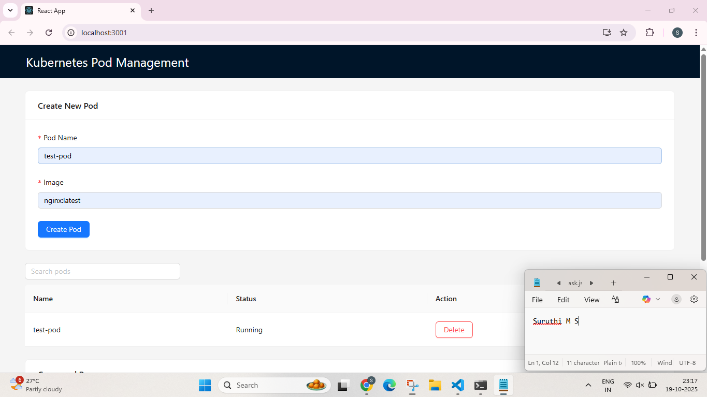
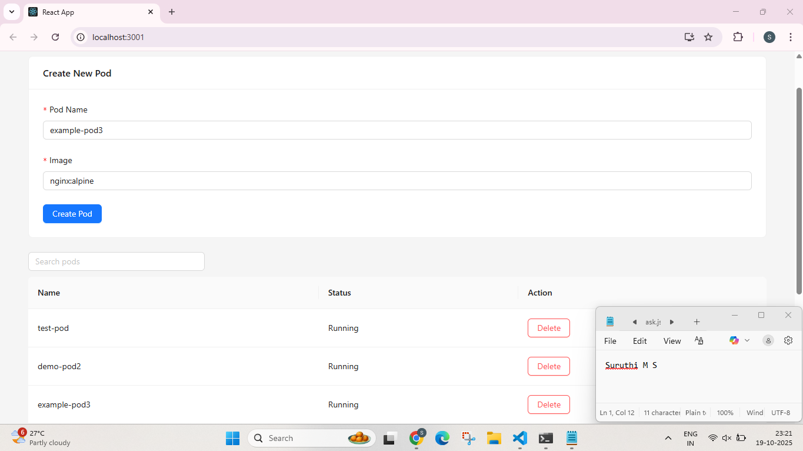
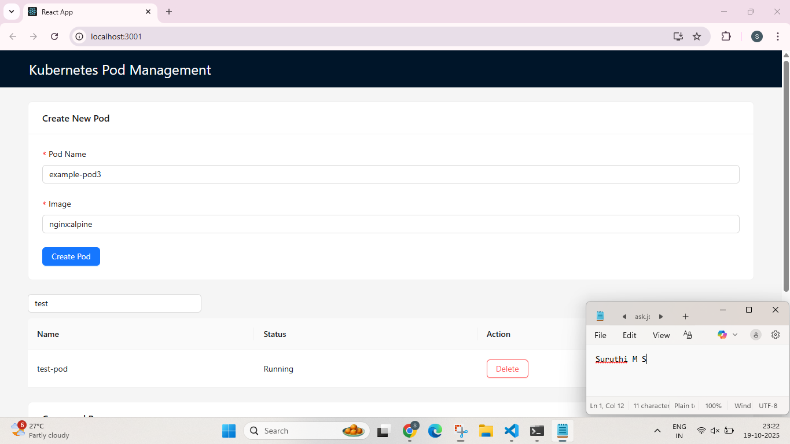
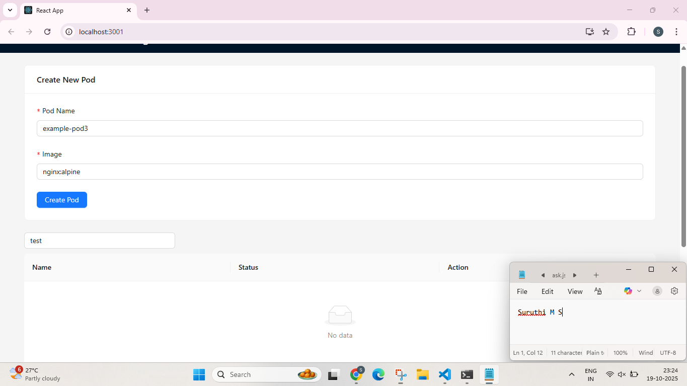
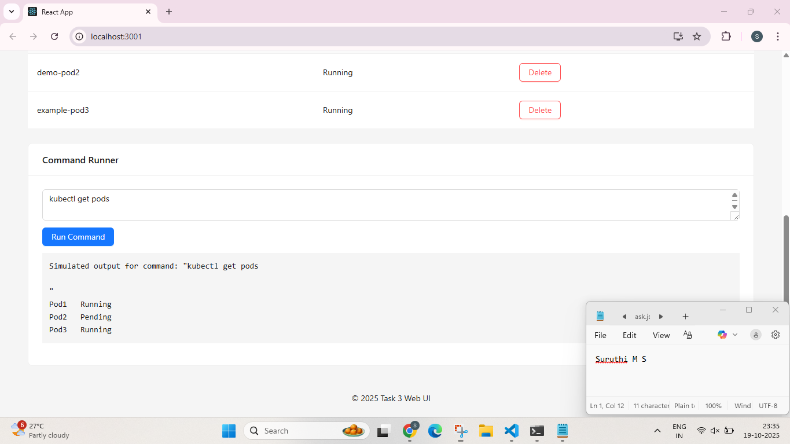

# Task 3 – Kubernetes Pod Management Web UI

**Candidate Name:** Suruthi M S

This repository contains the **React + TypeScript + Ant Design frontend** for managing Kubernetes pods.  
It is connected to the backend application (Task 1) that provides REST APIs for tasks/pods.  

---

## **Table of Contents**
1. [Overview](#overview)  
2. [Technologies Used](#technologies-used)  
3. [Project Structure](#project-structure)  
4. [Setup & Run](#setup--run)  
5. [Features](#features)  
6. [Screenshots](#screenshots)  
7. [Usage Instructions](#usage-instructions)  

---

## **Overview**
This Web UI allows you to:  
- Create a new Kubernetes pod  
- View all pods in a table  
- Search pods by name  
- Delete pods  
- Run commands in Kubernetes pods and view output  

The frontend dynamically updates pod lists and command outputs using API calls.  

---

## **Technologies Used**
- React 19  
- TypeScript  
- Ant Design  
- Axios (for HTTP requests)  
- Node.js & npm  

---

## **Project Structure**
```

task3-webui/
├── src/
│   ├── components/
│   │   ├── PodForm.tsx        # Form to create pods
│   │   ├── PodList.tsx        # Table to view, search, delete pods
│   │   └── CommandRunner.tsx  # Run commands & show output
│   ├── App.tsx                # Main layout combining components
│   └── api.ts                 # Axios API setup (optional)
├── public/
├── package.json
├── tsconfig.json
└── README.md

````

---

## **Setup & Run**
1. Clone the repository:
```bash
git clone <your-repo-url>
cd task3-webui
````

2. Install dependencies:

```bash
npm install
```

3. Start the development server:

```bash
npm start
```

4. Open the app in your browser:
   [http://localhost:3000](http://localhost:3000)

> **Note:** Ensure that the backend (Task 1 API) is running and accessible at the configured API URL. Adjust `axios` baseURL if necessary.

---

## **Features**

| Feature            | Description                                                     |
| ------------------ | --------------------------------------------------------------- |
| **Create Pod**     | Fill in `Pod Name` and `Image` in the form to create a new pod. |
| **View Pods**      | Table displays all pods with `Name` and `Status`.               |
| **Search Pods**    | Filter pods dynamically by typing in the search box.            |
| **Delete Pod**     | Remove pods from the list with the Delete button.               |
| **Command Runner** | Run shell commands inside Kubernetes pods and view output.      |

---

## **Screenshots**

> All screenshots include **system date/time** and **candidate name**.

1. **Pod Creation Form**
   

2. **Pod List / Table**
   
   


3. **Search Function**
   

4. **Delete Pod**
   

5. **Command Runner**
   

---

## **Usage Instructions**

1. **Create Pod:**

   * Enter pod name and image, then click `Create Pod`.
   * Pod list updates automatically.

2. **View / Search Pods:**

   * Scroll down to the table to view all pods.
   * Use the search box to filter pods by name.

3. **Delete Pod:**

   * Click the `Delete` button next to a pod.
   * Pod is removed and table updates automatically.

4. **Run Commands:**

   * Type a command in the command runner input (e.g., `kubectl get pods`).
   * Click `Run Command`.
   * Output will appear in the box below.

---

This README already covers:

- ✅ Project overview  
- ✅ Setup & run instructions  
- ✅ Features  
- ✅ Screenshots with placeholders  
- ✅ Usage instructions  


